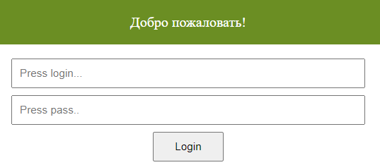
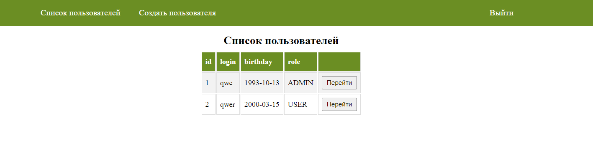
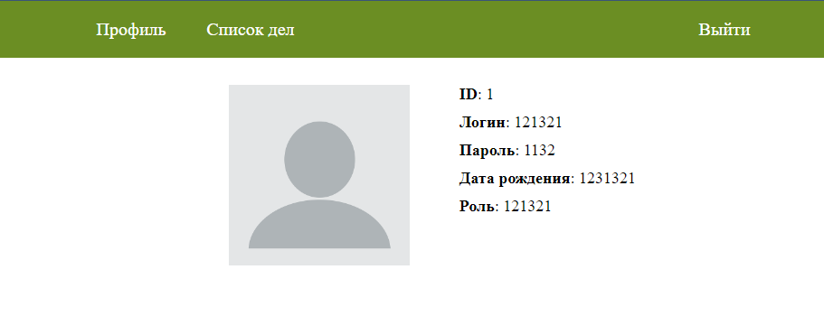

# Полезные ссылки

----
## [Ссылка на ДЗ](#техническое-задание-дз)
____
## Верстка
+ https://www.youtube.com/watch?v=MEOR2b69Pl4&t=3s - Гриды
+ https://www.youtube.com/watch?v=eVZEwEQg4pg - Флексы
+ https://www.youtube.com/watch?v=WWtEPKaSpIw - HTML/CSS/Bootstrap
## JSTL и EL
+ https://metanit.com/java/javaee/ - вся база по Java EE(наша глава 4), топ за свои деньги
+ https://www.tutorialspoint.com/jsp/jsp_standard_tag_library.htm - шпаргалка по JSTL
+ https://www.tutorialspoint.com/jsp/jsp_expression_language.htm - шпаргалка по EL

----

## JSTL(кукбук)

----
### Подключение зависимости в Maven и основные элементы на JSP странице
```xml
<dependency>
    <groupId>jstl</groupId>
    <artifactId>jstl</artifactId>
    <version>1.2</version>
</dependency>
```

```html
<%@ page contentType="text/html; charset=UTF-8" pageEncoding="UTF-8" %>
<%@ taglib uri="http://java.sun.com/jsp/jstl/core" prefix="c" %>
<html>
    <head>
        <style><%@include file="../styles/style.css"%></style>
    </head>
    <body>
        <%@include file="header.jsp" %>
        <div>
            
        </div>
    </body>
</html>
```

----

### Передача данных из сервлета в JSP

Есть несколько способов передачи данных из сервлета в jsp, которые заключаются в использовании определенного контекста или scope. Есть несколько контекстов для передачи данных:

* **request** (контекст запроса): данные сохраняются в HttpServletRequest
* **session** (контекст сессии): данные сохраняются в HttpSession
* **application** (контекст приложения): данные сохраняются в ServletContext

Данные из контекста запроса доступны только в пределах текущего запроса. Данные из контекста сессии доступны только в пределах текущего сеанса. А данные из контекста приложения доступны постоянно, пока работает приложение.

Но вне зависимости от выбранного способа передача данных осуществляется с помощью метода setAttribute(name, value), где name - строковое название данных, а value - сами данные, которые могут представлять различные данные.

### Получение данных на JSP странице
Это Expression Language, атрибуты достаются из контекстов, подробнее здесь - https://metanit.com/java/javaee/3.9.php

```html
${attribute}
${object.property}
```

----

### Пример по передачи и получению данных

**HelloServlet.java**
```java
@WebServlet("/hello")
public class HelloServlet extends HttpServlet {
    @Override
    protected void doGet(HttpServletRequest req, HttpServletResponse resp) throws ServletException, IOException {
        req.setAttribute("msg", "someMessage");
        req.getServletContext().getRequestDispatcher("/pages/hello.jsp").forward(req, resp);
    }
}
```

**hello.jsp**
```html
<%@ page contentType="text/html;charset=UTF-8" language="java" %>
<html>
<head>
    <title>Title</title>
</head>
<body>
Тут выводится сообщение - ${msg}
</body>
</html>
```

----

### Переход из сервлета

```java
resp.sendRedirect(req.getContextPath() + "/users");

req.getServletContext()
.getRequestDispatcher("/pages/users.jsp")
.forward(req, resp);
```


Получить и закрыть сессию(при выходе из аккаунта)
```java
HttpSession session = request.getSession(false);
session.invalidate();
```

### Основные JSTL операторы(остальное в шпоре)

```html
<c:if test="${какое-то условие}">
    показали контент, если выполнилось
</c:if>
```

```html
<c:choose>
    <c:when test="${Role.ADMIN.equals(user.getRole())}">
        Тут контент для админа
    </c:when>
    <c:when test="${Role.USER.equals(user.getRole())}">
        Тут для обычного пользователя
    </c:when>
    <c:otherwise>
        Если ничего выше не сработало
    </c:otherwise>
</c:choose>
```

```html
<c:forEach items="${users}" var="user">
    <tr>
        <td>${user.id}</td>
        <td>${user.login}</td>
        <td>${user.password}</td>
    </tr>
</c:forEach>
```

----
## Техническое задание (ДЗ)

----

#### Основные моменты для каждой страницы
* Весь контент должен быть отцентрирован с помощью контейнера!
* Не должно быть стандартных стилей для таблицы, кнопок и навигационной панели
* Страницу "Список дел" реализовывать не надо3!
* Все стили примерные, делайте как по кайфу, но постарайтесь концепцию сохранить

----

#### Что надо реализовать
1. [ ] Навигационная панель, которая будет отличаться для различных ролей

    #### Навбар для админа
    
    #### Навбар для обычного пользователя
    
    #### Навбар для неавторизованного пользователя вместе с формой авторизации
    

2. [ ] Стилизованная таблица со списком пользователей
    #### Стиль для таблицы примерный, можно сделать что-то свое
   
3. [ ] Сделать выход из аккаунта
4. [ ] Сделать страницу с профилем, она же открывается, когда админ выбирает в списке пользователя и нажимает "Перейти"(тут нужно передать айди того пользователя, на которого кликнули в списке).<br/> **Важно!** на странице должны показываться данные того человека, чей это профиль!

     
5. [ ] **ДОП!** Сделать отдельную страницу с регистрацией пользователя со следующими требованиями:
   - Ввод логина
   - Ввод пароля
   - Выбор роли(из выпадающего списка)
   - Выбор даты рождения из input type="date"
   - По нажатию на "Создать пользователя" форма отправляется на сервер, айди назначается автоматически(на 1 больше, чем у последнего в списке), пользователь сохраняется в список и отображается на странице со списком пользователей


